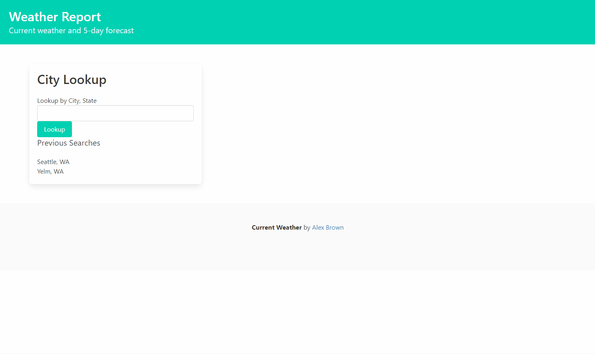

# weather-report

## Description

Efficient weather web-app that displays current weather condintions and a 5-day forcase. Features:

-   Lookup by city (major cities) or city, state (to avoid duplicates).
-   Previous searches section which locally saves search histroy for quick recall
-   Dynamically updating weather icons, description, temperature, wind speed, and humidity.
-   5-day forecast which provides concise weather information for the next 5 days.
-   Deployed to github for public use at [https://abrowncownow.github.io/weather-report/index.html](https://abrowncownow.github.io/weather-report/index.html)
-   Repo can be viewed at [https://github.com/abrowncownow/weather-report](https://github.com/abrowncownow/weather-report)

## Table of Contents

Use the links below to navigate to different sections of the README.

-   [Installation](#installation)
-   [Usage](#usage)
-   [Known Bug](#bug)
-   [Credits](#credits)
-   [License](#license)

## Installation

Website deployed to web via github pages for public use. No installation necessary. Recommend increasing speaker volume for best experience.

## Usage

Navigate to page in browser. Enter a city and state in the lookup box. Push enter or click the lookup button. You may also click on a previously searched city. Site will update with current weather and 5-day forecast.

## Bug

Clicking on a recently added search doesn't update current weather and 5-day forecast. Correct this by reloading the page.

## Credits

Developed by Alex Brown. Styled using [Bulma](bulma.io). Weather API provided by [OpenWeather](https://openweathermap.org/). Dates formatted using [Moment.js](https://momentjs.com/)

## License

Please refer to the LICENSE in the repo.